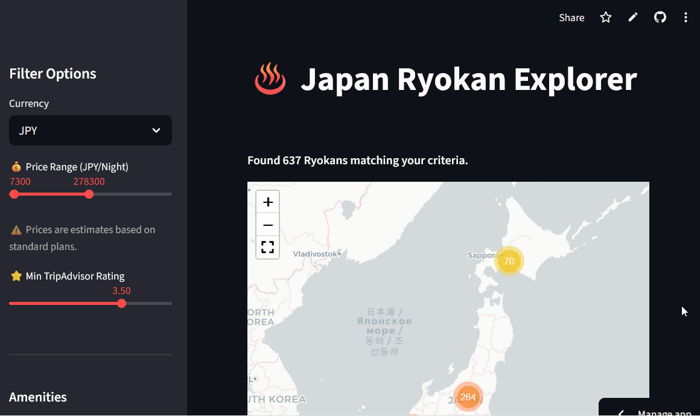

# Ryokan DB

This tool helps travelers discover the perfect Japanese Ryokan by visualizing hundreds of options on an interactive map with filters for price, ratings, and private onsen availability. It's available online at this address : https://ryokandb.streamlit.app/



## Local Setup

Follow these three steps to run the application locally:

1.  **Install Dependencies**
    Open your terminal and install the required Python libraries:
    ```bash
    pip install -r requirements.txt
    ```

2.  **Generate the Database**
    Scrape the data and fetch GPS coordinates (this runs once and creates `ryokans_db.csv`):
    ```bash
    python generate_db_ryokans.py
    ```

3.  **Launch the App**
    Start the interactive map in your browser:
    ```bash
    streamlit run streamlit_app.py
    ```